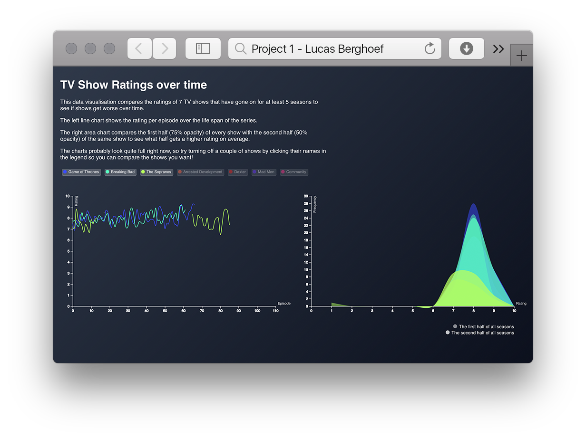

# Individueel Project A - Lucas Berghoef (500771170)

In this individual project I had to design a data visualisation where the user
can see (at least) three different sorts of insight (i.e. who, where, when, how,
what or why) from my dataset.

I used the following examples and data:
* Line Chart based on: https://bl.ocks.org/mbostock/3883245
* Area Chart based on: https://bl.ocks.org/mbostock/3883195
* Missing Data filter based on: https://bl.ocks.org/mbostock/3035090
* Background gradient made with: http://www.colorzilla.com/gradient-editor/
* Data by The Movie DB: https://www.themoviedb.org




# Data

### TV show ratings by users of The Movie DB

This data consists of ratings per episode of all the seasons of 7 well known TV
shows (with at least 5 seasons).
It consists of ratings of the following shows: Game of Thrones, Breaking Bad,
The Sopranos, Arrested Development, Dexter, Mad Men, Community.

Data from [`themoviedb.org`](https://www.themoviedb.org).

### Download link

https://developers.themoviedb.org/4/

### Format

JavaScript Object Notation (JSON) consisting of 76001 lines.

A selection of the most important keys (for me) in the dataset:
*   `Title` — Title of the TV show
*   `name` — Name of the episode
*   `overview` — A short synopsis of the episode
*   `id` — The ID number of the episode
*   `season_number` — The season that the episode belongs to
*   `still_path` — A link to an image of the episode
*   `vote_average` — The average score the episode gets
*   `vote_count` — The amount of times voted

### Example

```json
{
    "name": "Grifting 101",
    "overview": "The group is cheated and they try to get back at a grifter now teaching at Greendale.",
    "id": 1056490,
    "production_code": null,
    "season_number": 6,
    "still_path": "/wv5NQlqc45hJktyYSLAQVT5LcE0.jpg",
    "vote_average": 6.8,
    "vote_count": 5
}
```


# Features
* [`d3.json`](https://github.com/d3/d3-request/blob/master/README.md#json)- Returns a new request to get the JSON file at the specified url with the default mime type application/json.
* [`d3.select`](https://github.com/d3/d3-selection/blob/master/README.md#selection_select) - Selects the first element that matches the specified selector string.
* [`d3.scaleLinear`](https://github.com/d3/d3-scale#scaleLinear) - Constructs a new continuous scale with the unit domain [0, 1], the unit range [0, 1], the default interpolator and clamping disabled.
* [`d3.scale`](https://github.com/d3/d3-scale) - `d3.scaleTime` and `d3.scaleLinear` - Constructs new time scale and continuous scale.
* [`d3.max`](https://github.com/d3/d3-array/blob/master/README.md#max) - Compute the maximum value in an array.
* [`d3.axis`](https://github.com/d3/d3-axis/blob/master/README.md#axis) - Create a new axis generator.
* [`d3.line`](https://github.com/d3/d3-shape/blob/master/README.md#line) - Constructs a new line generator with the default settings.
* [`d3.area`](https://github.com/d3/d3-shape/blob/master/README.md#area) - Create a new area generator.
* [`d3.curveCatmullRom`](https://github.com/d3/d3-shape#curveCatmullRom) - Add a curve to the line for aesthetic pleasantness.


# My Process (changes in steps)

## 1. Creating a concept
I had to use the same subject (Movies) as with my assignment for 'Research for Data'.
However, the data of the subject I had chosen for that class (about Netflix)
wasn't very interesting to me anymore. So I wanted to choose a different data
subject. And TV show ratings on IMDb intrigued me a lot so I wanted to do
something with that. I often hear people say that the later seasons of a TV show
aren't as good as the first ones. So I want to put that to the test by comparing a
couple of TV shows to see if they do in fact get worse ratings over time, or not.

## 2. Finding a dataset
The plan was to initially obtain the data from IMDB. This choice was made because
IMDB is by far the largest aggregator of movie and tv show ratings by the average
viewer. Unfortunately, IMDB does not offer a well documented and easily accesible
API that would allow me to retreive the needed ratings in a efficient manner.

After coming to this conclusion I decided to research other well known rating
aggregators in search for one that offered a more developer friendly way to
obtain a useful dataset.

I ended up going with The Movie Database. A well known and trusted source for
movie and TV show ratings.

## 3. Choosing charts that match the dataset
My idea is to create two different graphs, a line chart that shows the ratings
of the shows over time. And a area chart that compares the first half of every
show with the second half, to see if the average rating of the first half is
higher than that of the second.
The line chart answer the questions: Who (the name of the TV show), What (the
rating of the episodes) and When (the number of the episode in chronological order).
The area chart answers the questions: Who (name of TV show), What (the frequency
of the rating) and When (the first half or the second half of the season).

## 4. Setting up the website
Because of the complexity of the various different DOM element I had to use,
I decided to write as much markup as I needed in the `index.html` file. This
approach allowed me to hook the JavaScript into the corresponding DOM elements
without having to take care of creating markup I already know had to exist.

## 5. Cleaning the data
As I was creating the charts I noticed that I was missing ratings for some
episodes. To avoid rendering this data (which would result in weird spikes in
an already complex chart) I decided to set these episodes `vote_count` values to
`null` and use `d3.defined` to ommit these from the chart.

 - `flattenSeason` function.
 - `renderLine` function.

## 6. Episode count calculation
To set the range of the bottom axis of the line chart I had to retrieve the
episode counts for each show. Normally D3 would offer a built in function to
achieve this. Nevertheless, because this dataset was split per season, I had to
count the amounts of episodes before issuing the `d3.max` function to find the
highest episode count.

## 7. Rating frequency calculation
For the area chart I wanted to show the ratings from a different perspective.
I decided to sum up the amount of times a rating occured and show this count
in the chart. To be able to compare the change in ratings per show, I had to
choose a point where I wanted to split the show in parts. As to now create too
big an amount of charts I split the shows in two parts and render an area for
both.

## 8. Communication between the legend and charts
I wanted to use the legend as a filter to select the shows that should be
visible in the charts. Because of the class based approach I had to find a way
to communicate from the `Legend` class to the charts. I created a function
in the parent class and passed that to the legend. This `filter` function
allowed me to call back to the parent class and then pass it's return value to
the charts.

## 9. Styling the charts
Added a dark neon colour scheme with a gradient background. Chose certain
colours that I thought were fitting with the theme of the TV shows (i.e. red for
Dexter). Made text white and more readable.


# To Do

* 1. Use a dataset with more complete data (like IMDB if possible)

# License

MIT © Lucas Berghoef
